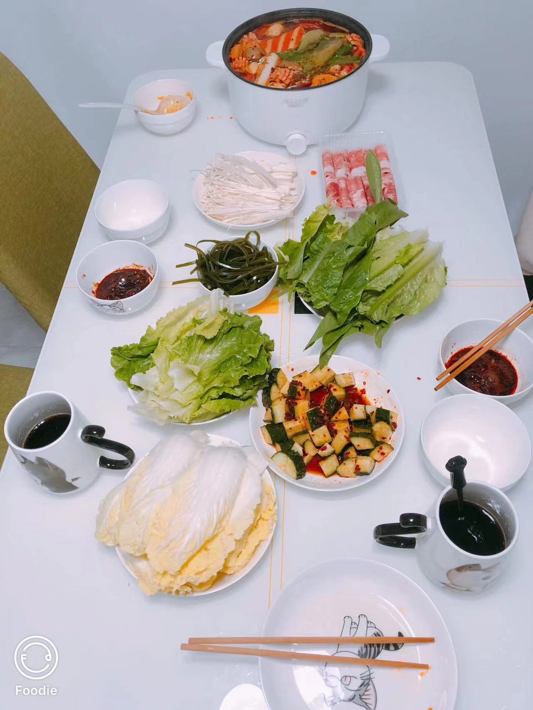
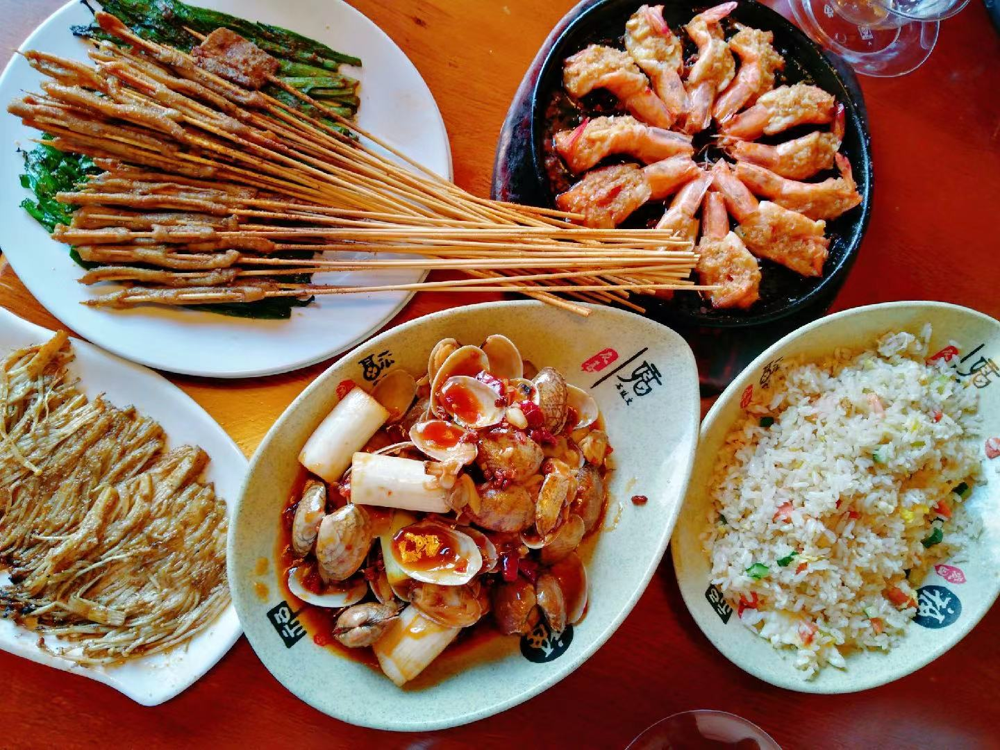
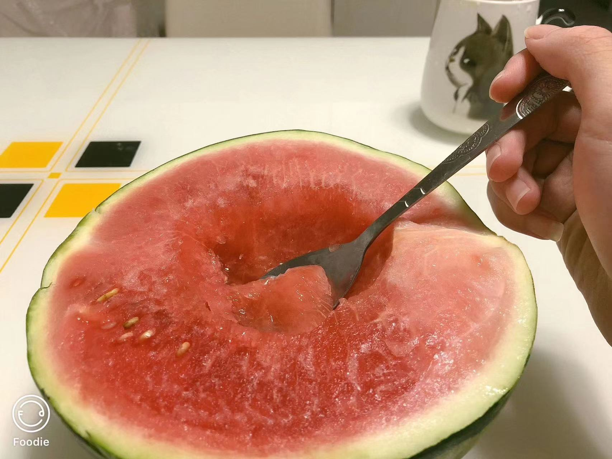

# 某人没给照片，所以为空

<!-- 蓦然回首，已是沧海桑田。 -->

<!--那年我大二，她大一。奶茶店里，正和室友喝奶茶，闲聊。突然一个女孩过来，要加我微信。哈哈，这辈子头一回。但我首先是拒绝了，傻傻的说了一句，我没有微信。这年头谁没有个微信？然后女孩跟我说她们是玩真心话大冒险，她输了，然后选了大冒险。我看向她们那一桌，一桌子的人都在向我这边看。为了不让她尴尬，我加了。女孩跟我说，等下删也行。最后这个联系人就一直在列表里面没有删了~

直到后来，在很短的时间里，在学校一直遇到她。但她每次都是急急忙忙的样子。不知怎么的，我在微信上鬼使神差的给她发起了信息，说最近一直遇到她。可尴尬的是，她早就忘了我长啥样。尬住，哈哈。接下来几天都一直跟她聊一些日常。

18 年年底，一次偶然的机会,班上一个大兄弟和她的一个小姐妹谈上了。然后叫出来一起玩，经过大兄弟的撮合，和她小姐妹的助攻。我和女孩成功在一起了。

记得第一次接吻，天时地利人和！那天是雷暴雨天，天色都是特别暗的那种，她跟我说打雷打的好大，特别吓人，有点害怕。因为室友都出去有事了，就一个人在寝室。我当时直接放下手机，就拿着伞出门，冲她们女寝室了。哈哈，第一次这么冲动。我敲门时候，她都惊了，没想到我会直接去她寝室。问我宿管阿姨没有拦我吗？咋拦得住嘛，我这急切的心。看都没看到我就上楼了。进寝室之后，她比较害羞，一直看着地，说不想让我看到她素颜的样子。这我可不同意了，我非要看，然后抱住她顺其自然的也亲了上去。

19 年中旬，我出学校实习，异地从此时开始。。

因为找不到本专业的工作，最后去做上了客服。客服岗位那时候一个月休息 4 天，我会尽量把假期调到一起，坐高铁去学校见她。。

19 年年底，疫情爆发。学校封校，防疫都特别紧张，见她便更加艰难。

20 年中旬，她放暑假了，而开学时间一直没有通知。她在家呆了两个月之后跟爸妈说学校开学了，然后来到了我工作的城市。开始了短暂的小情侣同居生活。那时候真的特别美好，真的好想好想永远停留在那一刻。

我上的都是晚班，下午 3 点到 12 点。下班时候总会经过一个烧烤摊，是个新疆的大叔。烤的是真的好吃，还挺便宜。我时不时就会买上一点烤鸭肠，火腿，肉串。给我家宝贝儿吃。有些时候，我回到家，就会吃到她煮好的螺蛳粉，拍黄瓜。哈哈，真的很温馨。

周末的时候，我们会一起去逛菜场。做个两菜一汤，或者直接买块火锅底料，一点青菜，一点肉丸做火锅吃。然后出了菜场，门口会有卖西瓜的，会买上半个带回家。每次看到她吃东西时候，满足的样子，就会想，这辈子足了！

客服终归不是长久之道，最开始还想着一边做客服，一边好好敲代码。可这真就是想想而已，下班之后只想着刷会剧，和她视频，然后睡觉。敲代码渐渐的就忘记的差不多了。每个月拿着四五千的工资，就有快两千贡献了房租。于是辞职，报了培训班学了前端，新的东西好好学，旧的东西重新捡起来，复习。培训持续半年，期间很少我去找她，因为没时间加上手上没钱。

分手

培训期间，因为时间很紧，每天学的东西都不一样，压力很大，不想辜负爸妈的期望。而她，也处于将要毕业的阶段，需要准备很多东西，每天还要排练毕业表演。两个人心情都不怎么好。。最后因为一个小事，引爆了异地以来，两个人堆积在心里的不满。。。结果不言而喻。

两个都很犟的人，在一起的时候基本上不会吵架，能一直很好。异地不断小矛盾。

虽然好几年过去了，还是一直会很想她。。。 -->

<!-- 

 -->
